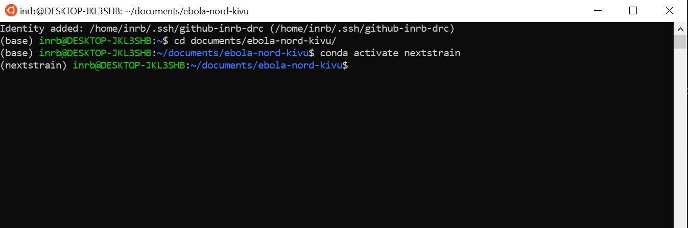

# Instructions on adding new sequences to the nextstrain build

Instructions for Eddy Kinganda Lusamaki to run the nextstrain build as new sequences become available and publish the results to github.

Authors: James Hadfield & Alli Black

---

## Step 1: Set things up

We want to open an ubuntu terminal where we can run all of the commands.
Click the "Ubuntu" button at the bottom of the screen:


This should open up a terminal window where you can type commands.

Here we want to navigate (move) into the folder where we store the information about ebola & nextstrain, called `ebola-nord-kivu`.
To do this we run
```
cd documents/ebola-nord-kivu
```
We then want to activate the nextstrain environment, which will make certain programs & commands available to us.
To do this we run
```
conda activate nextstrain
```

Finally we want to reset the contents of this folder (`ebola-nord-kivu`) to be exactly the same as what's online. This means that any changes Catherine, James or Alli have made will be downloaded to this laptop. However it will also clear out the `new_sequences` folder (see Step 2, below) -- so make sure you do this first!
```
./scripts/start
```

Here's an image of how the terminal should now look (the last line will contain slightly different wording):



We also want to open up an "explorer" in this same folder -- we've created a shortcut in the sidebar on the left of windows explorer for you. This window should look similar to:


---

## Step 2: Add the FASTA files of the seqeuences we want to add to the dataset

For the new sequences which you've received, you'll have a FASTA file for each consensus sequence.
FASTA files contain sequence data and are structured like:
```
>LABID_EXTRA_INFO
ATGGCCTTGATACCGAT...
```

You'll also have a "synthese" file which will contain the sequencing coverage for each of those consensus seqeunces.

#### Work out which sequences we want to add & add them to `new_sequences`
For each sequence which has over 70% coverage, we want to copy the FASTA file into the `new_sequences` folder within `ebola_nord_kivu`.

You should do this one-by-one, i.e. for each sequence which the "synthese" file indicates has over 70% coverage, copy the appropriate FASTA file into the `new_sequences` folder.

We should now have something like this, with the folder containing all the files (and the "synthese" file) given to you on the left, and the `new_sequences` folder on the right. Note that not all the sequences have been copied, only those with acceptable coverage. (Of course, the names of the seqeuences will be different each time!)


---

## Step 3: Add the metadata information for the sequences

> This is probably the toughest step, as the metadata provided to you is often incomplete & you will have to use your expertise and judgement to get the correct data!

> A note on dates: Dates must be written in the format "YYYY-MM-DD", i.e. September 10 2019 would be "2019-09-10". If you don't know the day, you can use "XX" instead -- i.e. "2019-09-XX" would represent a date anytime in September. If you only know the year, you can write "2019-XX-XX". The date of sample collection is extremely important so please try to find out the date if you can!

You'll have seen that when you start, there's an excel file in the `new_sequences` folder called `metadata.xlsx`. Open that up now, and you should see:

> If this excel file is ever missing for some reason, you can find a backup at `ebola-nord-kivu/data/template_metadata.xlsx`. Please copy that over into the `new_sequences` folder if needed.


We're now going to add in a line for each of the sequences we added in step 2. You'll have to refer to whatever excel files were provided to you with the sequences in order to find this information! Here is how the excel file should look when we've collected the information. 


Some points:

* It's ok to leave things blank if we don't know!

* The "strain" refers to the "lab ID", which is part of the sequence FASTA filename. The strain name is the portion of the FASTA header between the `>` character and the first `_`. For example, if the FASTA header is `>BEN1345_S3_DR_18` the strain name is simply `BEN1345`.

* If you ever need to modify the "lab ID", because it was incorrectly written by the sequencing team, you'll have to open up the FASTA file and correct the header (the first line, which begins with a `>` character)! You may need to contact the Epi team to ask them what is the correct lab ID.

Once you have entered all the data, save the excel file and close it. You need to close the excel file because the script you run below will need to clear the file once all the new data have been added to the rest of the data. If the file is left open, the computer can't change it.

Next we're going to run a small script to add these new sequences and data to the rest of the dataset. 
This script is designed to try to identify any errors and tell you about them so you can fix them before it will actually add them to the dataset.
You can run this script now:
```
./scripts/add-new-data
```

You'll need to read the messages which it prints to the terminal, as they will inform you if anything needs to be fixed.
If things need fixing, you simply rerun the script (`./scripts/add-new-data`) after making the corrections!

When it works, you should see something similar to:
```
Found 1 new metadata and 10 new sequences files :)
Writing (all) sequences & metadata into the data directory.
removing the files from 'new_sequences' that we've added to the data directory
```

---

## Step 4: Run Nextstrain!

We're now going to run the "nextstrain build", which runs all the instructions in the `Snakefile` for you.
You can run this via:
```
nextstrain build . clean
nextstrain build .
```

This can take some time (5 to 30 minutes) and you should see a lot of messages being printed to the terminal.

---

## Step 5: Visualise the results

When `nextstrain build` has finished we can visualise the results!
To do this we run:
```
nextstrain view auspice/
```
Which will print the following message to the screen


You can now open up the link that it tells you to (http://127.0.0.1:4000/ebola-nord-kivu in this example) and see the tree & map which has been produced!


You can search for strains to identify the new sequences which you've just added -- e.g. in this example build we added "BTB23817" and we can see it here:


---
## Step 6: Upload the data

When you're all happy, run the following script which will upload the data to github (https://github.com/inrb-drc/ebola-nord-kivu) which will also update the data that the world can view via https://nextstrain.org/community/inrb-drc/ebola-nord-kivu.

```
./scripts/upload
```

> It's really important to run this command when you're done, else the data won't be shared. Because step #1 resets the folder to what's online, if you run that without having run `./scripts/upload` beforehand then all your new sequences will be lost!