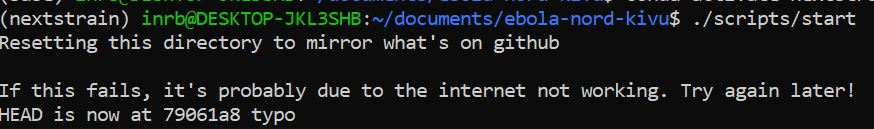
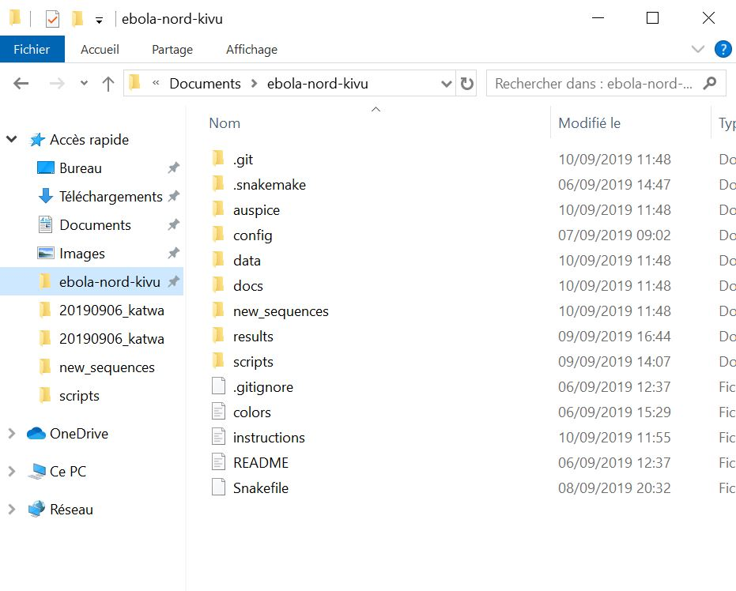
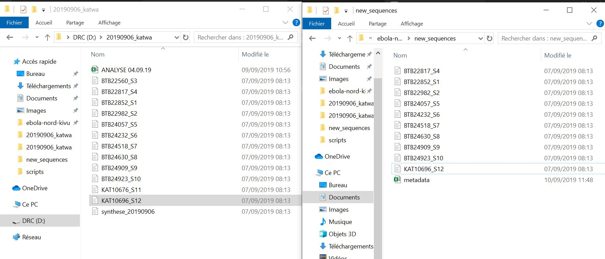
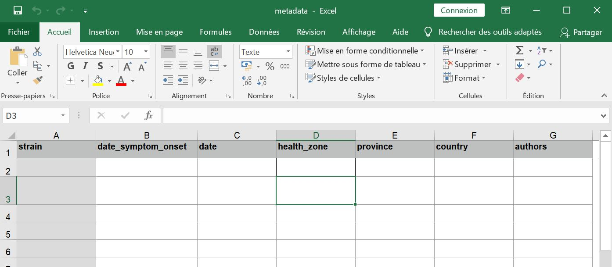
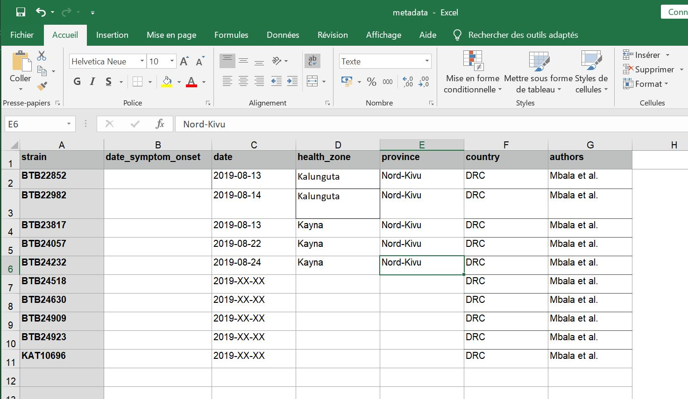
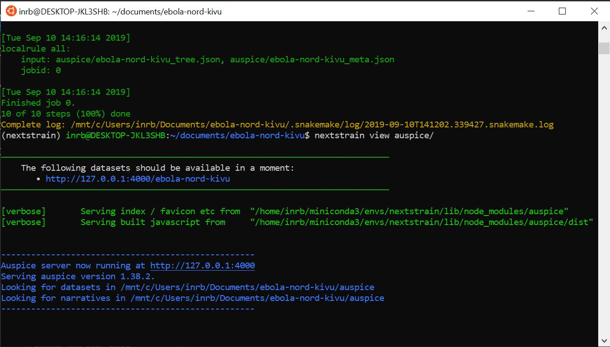
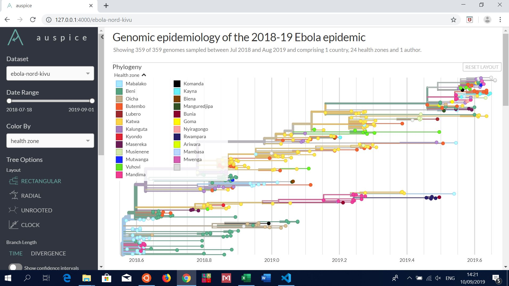
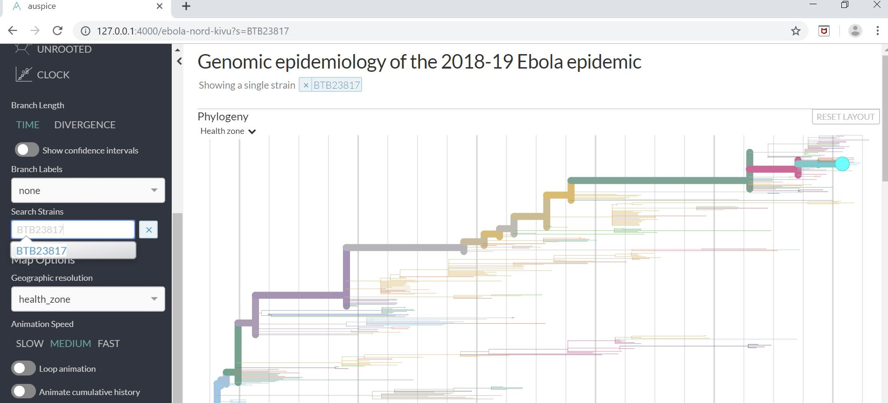
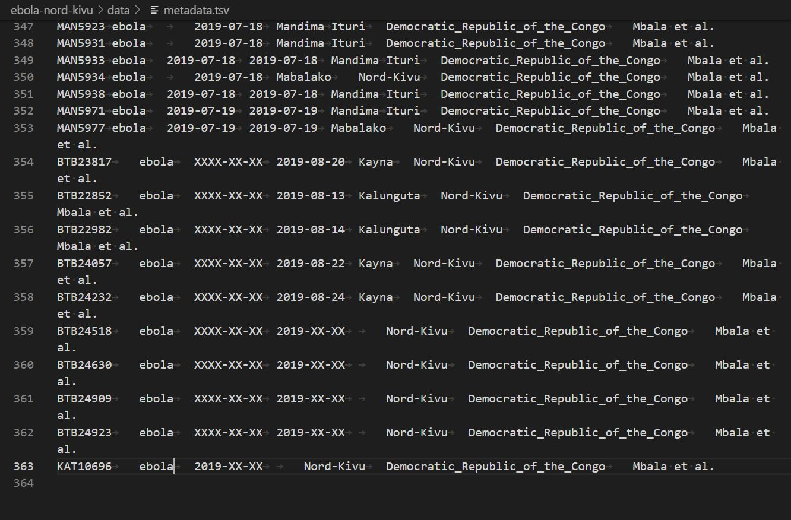

# Instructions on adding new sequences to the nextstrain build

Instructions for Eddy Kinganda Lusamaki to run the nextstrain build as new sequences become available and publish the results to github.

Authors: James Hadfield & Alli Black

---

## Step 1: Set things up

We want to open an ubuntu terminal where we can run all of the commands.
Click the "Ubuntu" button at the bottom of the screen:


This should open up a terminal window where you can type commands.

Here we want to navigate (move) into the folder where we store the information about ebola & nextstrain, called `ebola-nord-kivu`.
To do this we run
```
cd documents/ebola-nord-kivu
```
We then want to activate the nextstrain environment, which will make certain programs & commands available to us.
To do this we run
```
conda activate nextstrain
```

Finally we want to reset the contents of this folder (`ebola-nord-kivu`) to be exactly the same as what's online. This means that any changes Catherine, James or Alli have made will be downloaded to this laptop. However it will also clear out the `new_sequences` folder (see Step 2, below) -- so make sure you do this first!
```
./scripts/start
```

When you run this script, you'll get the following messages printed to your screen:

```
Resetting this directory to mirror what's on github

If this fails, it's probably due to the internet not working. Try again later!
```

If the script has worked as it is supposed to, you will get one more message that says:

```
HEAD is now at <some numbers and letters> <some message>
```

For example, it'll look something like this



But with a different number and letter code than 79061a8 and a different message than "typo".

_note: the message starting with HEAD will have a different number and probably a different message each time you run this script._


Next you'll want to open up an Windows "explorer" window in this same folder -- we've created a shortcut in the sidebar on the left of windows explorer for you. This window should look similar to:



---

## Step 2: Add the FASTA files of the seqeuences we want to add to the dataset

When you receive new sequences from the lab in Katwa, you will likely receive an email containing multiple FASTA files, as well as a "synthese" text file which contains statistics about the sequencing run, and an excel file containing the metadata about the sequenced samples. If you download all of these files with one click, then you should have them on the computer in a folder called `Téléchargements`. Its possible that the files will all download as a `.zip` file. In this case, within `Téléchargements` there should be another file that is labelled with whatever was in the subject line of the email you received. If you double click on that folder, you should see all the files you need inside it.

For the new sequences which you've received, you'll have a FASTA file for each consensus sequence.
FASTA files contain sequence data and are structured like:
```
>LABID_EXTRA_INFO
ATGGCCTTGATACCGAT...
```

You'll also have a "synthese" file which will contain the sequencing coverage for each of those consensus sequences. To make the "synthese" file easier to read, when you open it up press the keys `alt + z`. This "wraps" the genetic sequence so that it's all on one line, which will make it easier to see the % coverage for each sample.

#### Work out which sequences we want to add & add them to `new_sequences`
For each sequence which has over 70% coverage, we want to copy the FASTA file into the `new_sequences` folder within `ebola_nord_kivu`.

You should do this one-by-one, i.e. for each sequence which the "synthese" file indicates has over 70% coverage, copy the appropriate FASTA file into the `new_sequences` folder.

We should now have something like this, with the folder containing all the files (and the "synthese" file) given to you on the left, and the `new_sequences` folder on the right. Note that not all the sequences have been copied, only those with acceptable coverage. (Of course, the names of the seqeuences will be different each time!)




---

## Step 3: Add the metadata information for the sequences

> This is probably the toughest step, as the metadata provided to you is often incomplete & you will have to use your expertise and judgement to get the correct data!

> A note on dates: Dates must be written in the format "YYYY-MM-DD", i.e. September 10 2019 would be "2019-09-10". If you don't know the day, you can use "XX" instead -- i.e. "2019-09-XX" would represent a date anytime in September. If you only know the year, you can write "2019-XX-XX". The date of sample collection is extremely important so please try to find out the date if you can!

You'll have seen that when you start, there's an excel file in the `new_sequences` folder called `metadata.xlsx`. Open that up now, and you should see:

> If this excel file is ever missing for some reason, you can find a backup at `ebola-nord-kivu/data/template_metadata.xlsx`. Please copy that over into the `new_sequences` folder if needed.



We're now going to add in a line for each of the sequences we added in step 2. You'll have to refer to whatever excel files were provided to you with the sequences in order to find this information! Here is how the excel file should look when we've collected the information.



Some points:

* It's ok to leave things blank if we don't know!

* The "strain" refers to the "lab ID", which is part of the sequence FASTA filename. The strain name is the portion of the FASTA header between the `>` character and the first `_`. For example, if the FASTA header is `>BEN1345_S3_DR_18` the strain name is simply `BEN1345`.

* If you ever need to modify the "lab ID", because it was incorrectly written by the sequencing team, you'll have to open up the FASTA file and correct the header (the first line, which begins with a `>` character)! While you _do_ need to change the FASTA header inside the file, you _do not_ need to rename the file. After you change the ID in the FASTA header, remember to save the file. If the lab ID reported in the "Analyse" file is different from the lab ID reported in the FASTA header, you should contact the Epi team or the Ministry of Health to ask them what is the correct lab ID.

Once you have entered all the data, **save the excel file and close it**. You need to close the excel file because the script you run below will need to clear the file once all the new data have been added to the rest of the data. If the file is left open, the computer can't change it.

Next we're going to run a small script to add these new sequences and data to the rest of the dataset.
This script is designed to try to identify any errors and tell you about them so you can fix them before it will actually add them to the dataset.
You can run this script now:
```
./scripts/add-new-data
```

You'll need to read the messages which it prints to the terminal, as they will inform you if anything needs to be fixed.
If things need fixing, you simply rerun the script (`./scripts/add-new-data`) after making the corrections!

When it works, you should see something similar to:
```
Found 1 new metadata and 10 new sequences files :)
Writing (all) sequences & metadata into the data directory.
removing the files from 'new_sequences' that we've added to the data directory
```

You can tell that it has worked because the script will have removed the FASTA files that you placed in the `new_sequences` folder.
---

## Step 4: Run Nextstrain!

We're now going to run the "nextstrain build", which runs all the instructions in the `Snakefile` for you.
You can run this via:
```
nextstrain build . clean
nextstrain build .
```

This can take some time (5 to 30 minutes) and you should see a lot of messages being printed to the terminal.

---

## Step 5: Visualise the results

When `nextstrain build` has finished we can visualise the results!
To do this we run:
```
nextstrain view auspice/
```
Which will print the following message to the screen




You can now open up the link that it tells you to (http://127.0.0.1:4000/ebola-nord-kivu in this example) and see the tree & map which has been produced!



You can search for strains to identify the new sequences which you've just added -- e.g. in this example build we added "BTB23817" and we can see it here:



When you're done exploring the tree locally, and you are ready to upload the data publicly, in order to get your terminal back you'll need to stop running `nextstrain view`. To stop it, type:

`ctrl + c`

Typing `ctrl + c` will stop the process, your terminal will give you a cursor back so you can go back to entering commands.

---
## Step 6: Upload the data

When you're all happy, run the following script which will upload the data to github (https://github.com/inrb-drc/ebola-nord-kivu) which will also update the data that the world can view via https://nextstrain.org/community/inrb-drc/ebola-nord-kivu.

```
./scripts/upload
```

> It's really important to run this command when you're done, else the data won't be shared. Because step #1 resets the folder to what's online, if you run that without having run `./scripts/upload` beforehand then all your new sequences will be lost!


-----------------------------

## Updating metadata if you receive new information from the epidemiologists

Sometimes you will receive data about the samples that are incomplete. For example, it's possible that you will receive "date of notification" rather than "date of sample collection". In other cases, there might be no information about the sample sent to you at all. While you can still run nextstrain as described above when this information is missing, once you have the updated information, you should add the new information and re-run nextstrain. The instructions below tell you how to re-run the build if you are **changing metadata about a sample, but you have PREVIOUSLY followed the steps above to add the sequences to nextstrain by placing the FASTA files in the `new_sequences` folder.**

A lot of the steps are exactly the same as above, but they are still listed here so that you have the order of the steps.

1. Open up an ubuntu terminal window, as described above.

2. Move into the folder where we store the information about ebola & nextstrain, called `ebola-nord-kivu`.
To do this we run
```
cd documents/ebola-nord-kivu
```
3. Activate the nextstrain environment by running:
```
conda activate nextstrain
```
4. Reset the contents of this folder (`ebola-nord-kivu`) to be exactly the same as what's online. To do this, run:
```
./scripts/start
```

5. Rather than moving FASTA files into the `new_sequences` folder, this time you will update the metadata information directly in the `metadata.tsv` file that is in the `data` folder. To do this open up a Windows "explorer" window in this same folder (the `ebola-nord-kivu` folder) -- we've created a shortcut in the sidebar on the left of windows explorer for you. This window should look similar to:


Double click on the `data` folder. Then, double click on the file called `metadata`. This will open the `metadata` file up in a program called VSCode. It should look something like this:



This file is exactly like what you might open up in excel, but instead of the lines that define the cells in excel, the cells here are defined by tabs, which are those little grey arrows you can see in the picture. Keeping the placement of these tabs is important, because if you accidentally delete one, it is like deleting a cell from excel, and your entire row shifts over!

The information is ordered as follows, using the sample in the last line of the image above as an example.

|strain|virus|date_symptom_onset|date|health_zone|province|country|authors|
|------|-----|------------------|----|-----------|-------|--------|-------|
|BTB23817|ebola|XXXX-XX-XX|2019-08-20|Kayna|Nord-Kivu|Democratic_Republic_of_the_Congo|Mbala et al.|

In this example, if you had information about the date of symptom onset, you would delete `XXXX-XX-XX` and replace it with the known date.

6. Once you have made all of the edits to the metadata file that you would like to make, you are ready to rerun nextstrain!

To do so, run:
```
nextstrain build . clean
```
```
nextstrain build .
```

7. Once the build is finished, you can look at the resulting tree by running:

```
nextstrain view auspice
```

If you've added previously unknown health zones, you'll see that the coloring for the sample has changed in the tree to reflect what the new health zone is! Other changes might be harder to see, but they should be in there :)

8. The last and very important step is to push this updated nextstrain build up to GitHub. If you don't do this step, then the changes you made will not be made public, and they will get overwritten the next time you run a nextstrain build. To sync these changes to GitHub, run:


```
./scripts/upload
```
